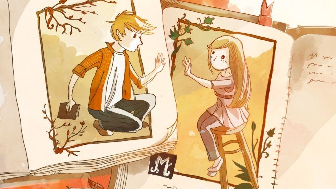

---

layout: post
title:  "Wedding"
date:   2013-10-13 12:00:00

---

{: .center data-action='zoom'}

Si vous êtes né dans le début des années 90, vous êtes peut-être en train de vivre quelque-chose : Vos amis deviennent des adultes.

Aujourd'hui, la plupart de mes amis travaillent. Certains vivent en couple depuis maintenant quelques années. Des événements ont eu lieu cette année, et ils me font me sentir plus vieux : Un de mes camarades actuel est papa d'une petite fille de 4 an, et un de mes collègues a eu un garçon il y a quelques mois. La semaine prochaine, c'est encore un autre ami de ma classe qui va se marrier. Même si j'ai l'impression que je viens de quitter le lycée, je dois admettre que je suis un adulte

___

If you're born in the early nineties, you may be experiencing something : your friends becoming real adults.

Most of friends are now working. Some are in a relationship for while now. Events occured within this year and made me feel older : One of my school buddy is dad of a 4 years old girl, and an other one had a boy few month ago. Next week, a friend of mine will get married. So, even if I still feel like I left high school yesterday, I have to admit that I'm becoming an adult