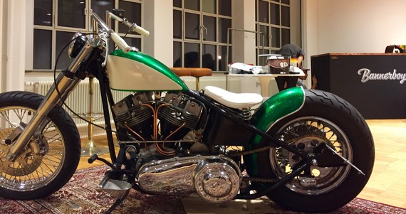
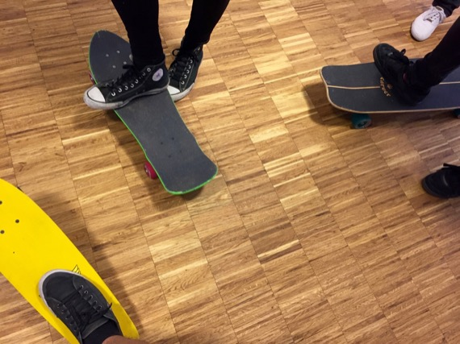
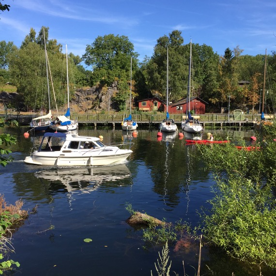
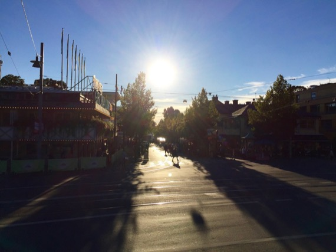
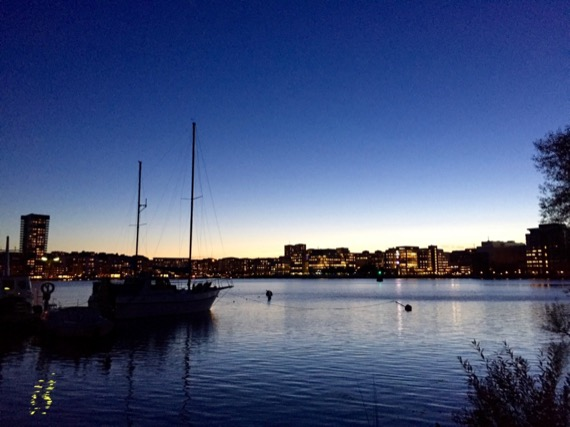

---

layout: post
title:  "6 months in Sweden"
date:   2015-12-14 14:00:00
categories: travel english ★

---

Already 6 months… I barely believe time flows that fast. Little update [from my last report (in French)](http://axelrock.fr/un-mois-en-suede/).

## Bannerboy

<blockquote class="instagram-media" data-instgrm-captioned data-instgrm-version="6" style=" background:#FFF; border:0; border-radius:3px; box-shadow:0 0 1px 0 rgba(0,0,0,0.5),0 1px 10px 0 rgba(0,0,0,0.15); margin: 1px; max-width:658px; padding:0; width:99.375%; width:-webkit-calc(100% - 2px); width:calc(100% - 2px);">
 
 

 
 <a href="https://www.instagram.com/p/6Pd2iFjU_M/" style=" color:#000; font-family:Arial,sans-serif; font-size:14px; font-style:normal; font-weight:normal; line-height:17px; text-decoration:none; word-wrap:break-word;" target="_blank">Light up! / Pimp my office / Bannerboy</a>
 
A photo posted by Axel Rock (@axel.rock) on <time style=" font-family:Arial,sans-serif; font-size:14px; line-height:17px;" datetime="2015-08-11T11:37:20+00:00">Aug 11, 2015 at 4:37am PDT</time>

</blockquote>  

Since I'm a developer, I've always liked my work. And working in Stockholm for Bannerboy is no different. It's hard to imagine a better place.

Talking about work itself, it's way more stimulating than I hoped when I was hired. Projects are quick and challenging, clients are prestigious and there is no pressure.

But if I love the company that much, it's mainly because of the vibe here. When I stay late at the office, it's more often a pleasure than a duty. Our bosses do everything to make us feel good. And it works! Ping-pong table, PS4, beer, restaurant night or climbing session...

{: srcset="../images/2015-12-14-6-mois-en-suede/bike@2x.jpg 2x" data-action='zoom'}

Yes. It's an Harley. In the office.

 

{: srcset="../images/2015-12-14-6-mois-en-suede/skate@2x.jpg 2x" data-action='zoom'}

Skateboard is the favorite means of transport here.

## New apartment

Housing is THE main drawback of living in Sweden, or at least in Stockholm. It's expensive, there are very few offers, and most of the websites have a subscription fee.

But… 

After a few weeks, and a lot of emails, I've been really lucky one again.

I now share a pretty cool apartment with a cool Brazilian guy on a pretty island in Stockholm. A little piece of heaven really close to the center and with a bus that brings me directly from my door to my office…

Here is the view from the island :

{: srcset="../images/2015-12-14-6-mois-en-suede/home-1@2x.jpg 2x" data-action='zoom'}

{: srcset="../images/2015-12-14-6-mois-en-suede/home-2@2x.jpg 2x" data-action='zoom'}

## Swedish lessons

I started learning Swedish. After about 15 hours [at school](https://en.wikipedia.org/wiki/Swedish_for_immigrants), I now have lessons at the office once a week.

This is an interesting language, but weird in the beginning. Then I understood that it is quite logical, and objectively less complicated than French. I'm really looking forward to having real-life conversations in Swedish.

## Stockholm

When I came here, I hoped I'd fall in love with [a Swede](http://i.skyrock.net/5581/58515581/pics/2642954474_small_1.jpg). It didn't happen yet. But I kind of fell in love with my company and the city. From all the European capitals I've been, Stockholm is probably the one I like the most.

When I arrived, I didn't really know what to expect. I wasn't sure I would like it. But I love being here. To be honest, the only thing I miss from France is my family and my friends. And maybe good pizza.

I love my work, I love the city, people are nice, food is really good… I couldn't ask for more.

{: srcset="../images/2015-12-14-6-mois-en-suede/stockholm-1@2x.jpg 2x" data-action='zoom'}

{: srcset="../images/2015-12-14-6-mois-en-suede/stockholm-2@2x.jpg 2x" data-action='zoom'}

{: srcset="../images/2015-12-14-6-mois-en-suede/stockholm-3@2x.jpg 2x" data-action='zoom'}

<blockquote class="instagram-media" data-instgrm-captioned data-instgrm-version="6" style=" background:#FFF; border:0; border-radius:3px; box-shadow:0 0 1px 0 rgba(0,0,0,0.5),0 1px 10px 0 rgba(0,0,0,0.15); margin: 1px; max-width:658px; padding:0; width:99.375%; width:-webkit-calc(100% - 2px); width:calc(100% - 2px);">
 
 

 
 <a href="https://www.instagram.com/p/7Tb2QxjU14/" style=" color:#000; font-family:Arial,sans-serif; font-size:14px; font-style:normal; font-weight:normal; line-height:17px; text-decoration:none; word-wrap:break-word;" target="_blank">Rainy day / amazing sunset / new apartment</a>
 
A photo posted by Axel Rock (@axel.rock) on <time style=" font-family:Arial,sans-serif; font-size:14px; line-height:17px;" datetime="2015-09-06T21:08:11+00:00">Sep 6, 2015 at 2:08pm PDT</time>

</blockquote> 

 

___

Now I'm in Amsterdam, then I'll go to Germany, then back to France for Christmas and New Year's Eve. But if you come around Stockholm in 2016, feel free to tell me and we'll have a coffee or a beer.

Bye